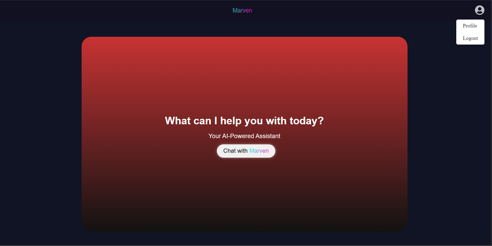

# Marven AI Chatbot

Marven is an interactive chatbot built using React, Vite, HTML, CSS, and JavaScript. It fetches data using Google and provides a seamless user experience with an intuitive UI.

## Features

- **Built with React & Vite** for fast performance and modern development.
- **Google Data Fetching** for real-time, accurate responses.
- **Interactive UI** with a responsive and user-friendly design.
- **HTML, CSS, JavaScript** used for frontend structure and styling.
- **Voice Input Button** allowing users to dictate their messages instead of typing.

## Screenshots

## Technologies Used

-  **React** (with Vite)
-  **Google API (or custom data-fetching logic)**
-  **HTML**
-  **CSS**
-  **JavaScript**

## Usage

- Open the app in your browser after running the development server.
- Type your query in the chatbox, and Astro AI will fetch relevant data using Google.
- Use the **Voice Input Button** to dictate your message instead of typing.
- Enjoy real-time responses and an interactive user experience.

## Contributing

Contributions are welcome! Feel free to open an issue or submit a pull request.

## License

This project is licensed under the [MIT License](MIT-LICENSE).
